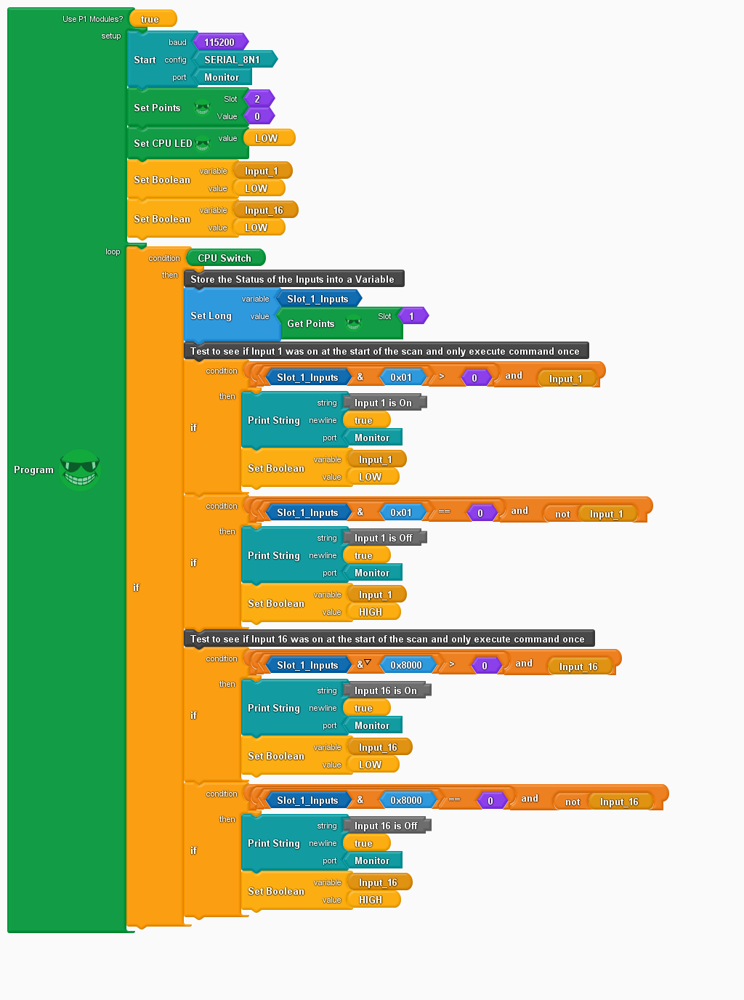

Inputs
======

An example using the P1-16ND3 input module with the P1AM-100 PLC to execute
commands only once when an input is toggled.

Starting from the top Use P1 Modules? is set to true so the backplane is powered.

Setup
-----

Start serial communications.

If you have an output card(s) set the points to 0 (off).

Set the CPU LED Low (off)

Set two boolean variable Low (False). This is used to execute the commands only
once and is set to Low so it matches the Off condition of the inputs.

Loop
----

The first condition is an if then test that uses the CPU Switch to start.

The first thing you want to do is to store the status of the inputs into a long
variable. This is done so you only have to poll the input card once per scan to 
have the fastest program time.

There are two pairs of if then tests, one for input 1 and one for input 16.

The first if/then block tests to see if the input is on and the boolean variable
is high (true). If that condition is true then print to the serial monitor and
set the boolean variable to low. The next scan if the input is still on the
condition is now false because the boolean is low.

The condition uses bit masking to look only at the first bit of the variable
Slot_1_Inputs.

Left to right the condition is: ((Slot_1_Inputs variable and 0x01) is greater
than 0) and Input_1 is high.

The second if/then block tests to see if the input is off and the boolean
variable is low (false). If the condition is true then print to the serial
monitor and set the boolean variable high. The next scan if the input is still
off the condition is now false because the boolean is high.

Left to right the condition is: ((Slot_1_Inputs variable and 0x01) is equal to 0)
and Input_1 is not high.

Bitwise And
-----------
::

	Slot 1 Input 1 is Off
		             Binary
	Slot_1_Inputs  1 0 0 1 1 0 1 0 1 0 1 1 1 0 0 0
	And Hex 0x01   0 0 0 0 0 0 0 0 0 0 0 0 0 0 0 1
	Result         0 0 0 0 0 0 0 0 0 0 0 0 0 0 0 0

	Slot 1 Input 1 is On
		             Binary
	Slot_1_Inputs  1 0 0 1 1 0 1 0 1 0 1 1 1 0 0 1
	And Hex 0x01   0 0 0 0 0 0 0 0 0 0 0 0 0 0 0 1
	Result         0 0 0 0 0 0 0 0 0 0 0 0 0 0 0 1

